# 基于Springboot的学生读书笔记共享

## Springboot-0017


## 技术栈

Springboot mybatisplus vue mysql maven


## 数据库表(10张)


## 功能介绍

```properties
1、开发实现读书笔记共享平台的整个系统程序； 
2、管理员；首页、个人中心、用户管理、笔记分享管理、个人笔记管理、管理员管理、交流互动、系统管理等。
3、用户：首页、个人中心、笔记分享管理、个人笔记管理、我的收藏管理。
4、前台首页：首页、笔记分享、交流信息、个人中心、后台管理等相应操作；
5、基础数据管理：实现系统基本信息的添加、修改及删除等操作，并且根据需求进行交流信息的查看及回复相应操作。
```


## 图片

### 前台


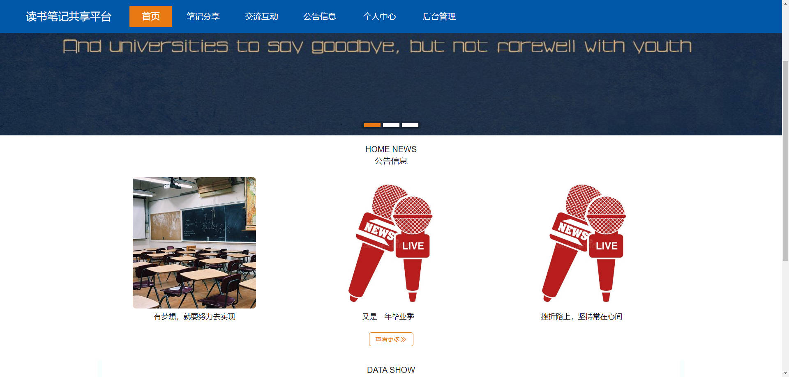


### 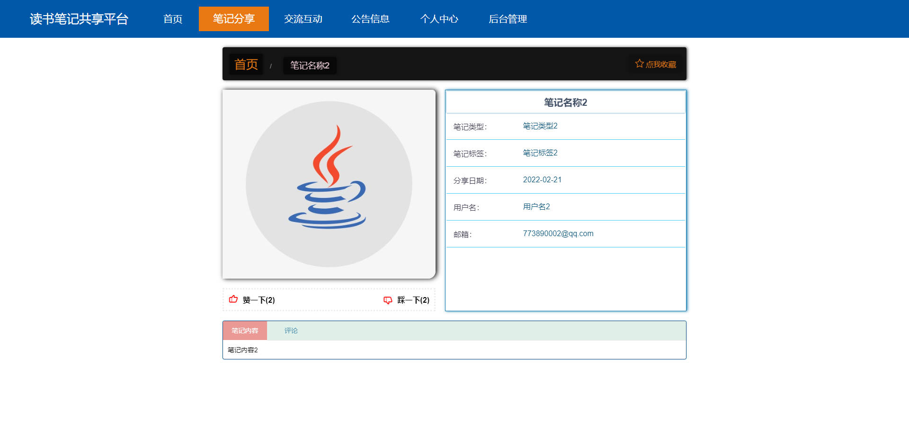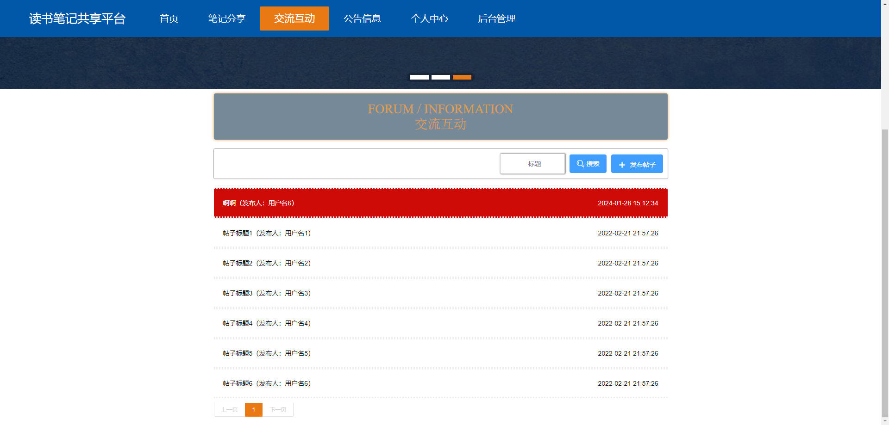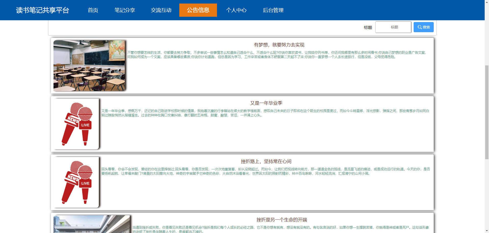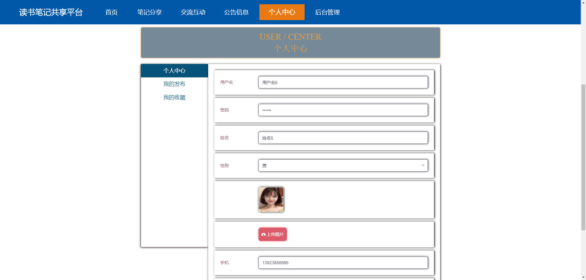后台


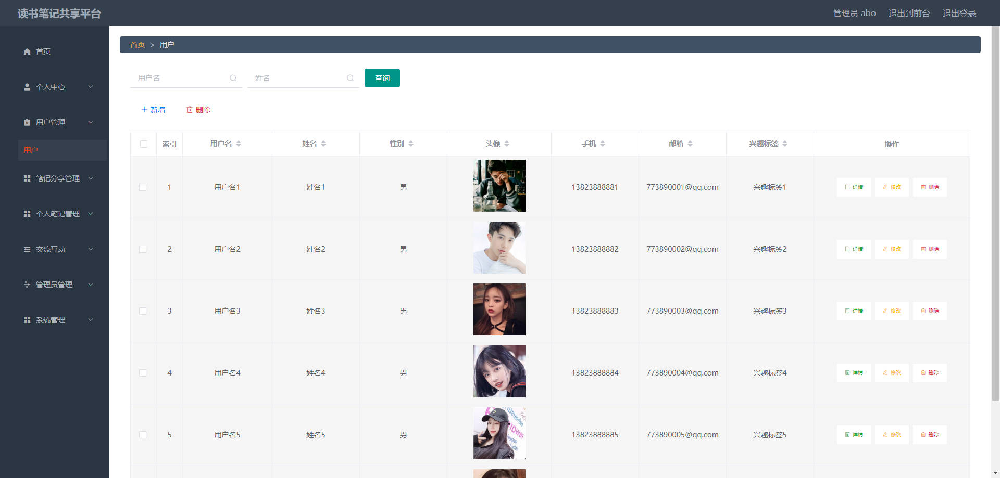

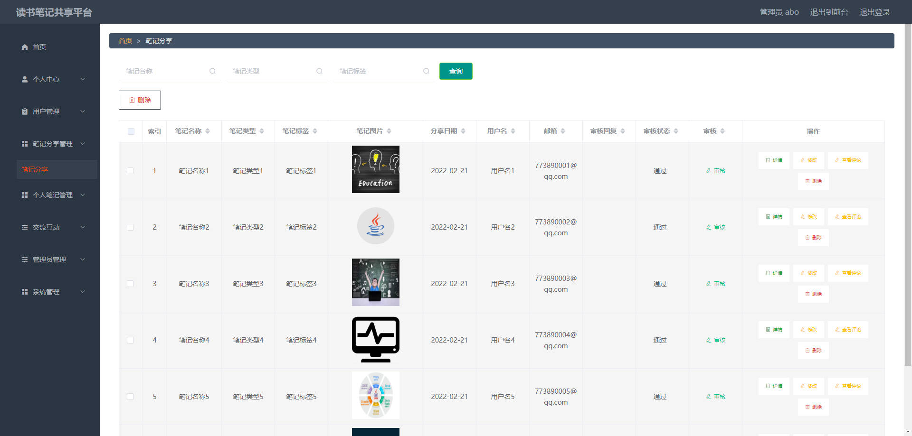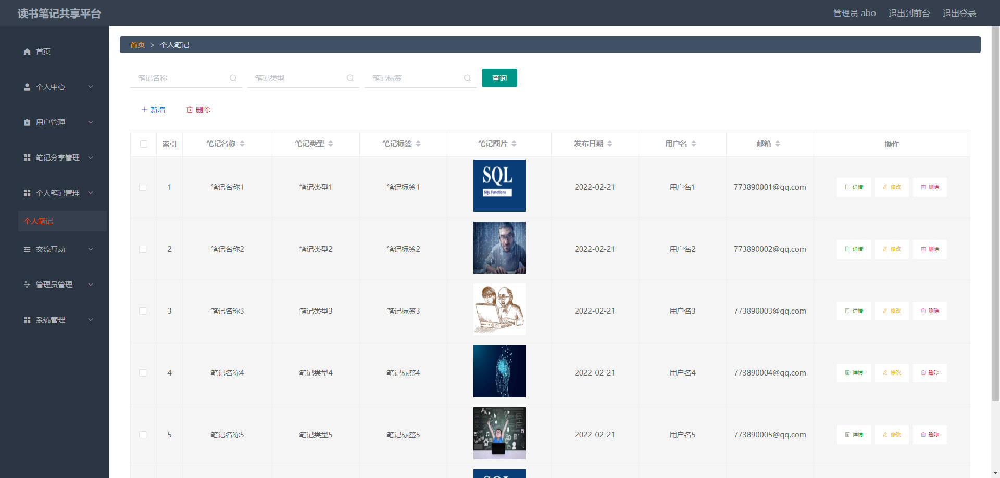

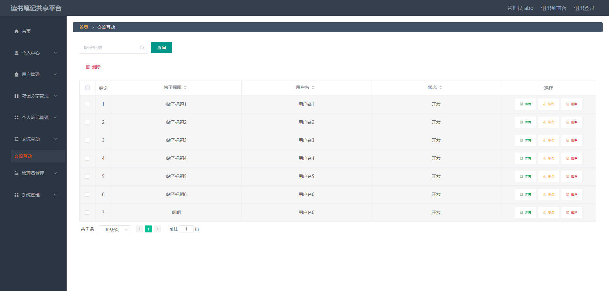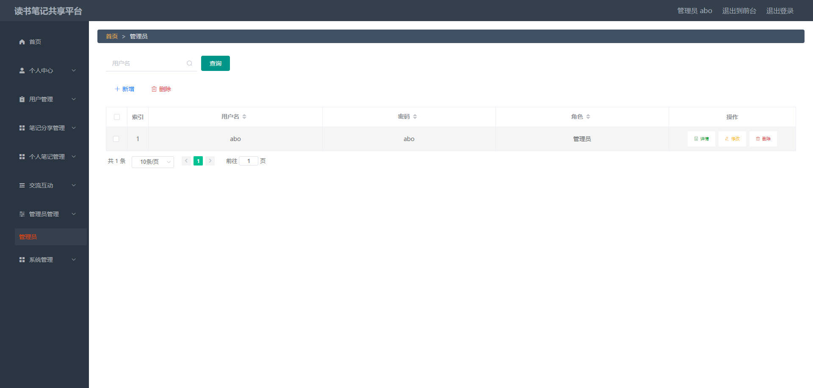

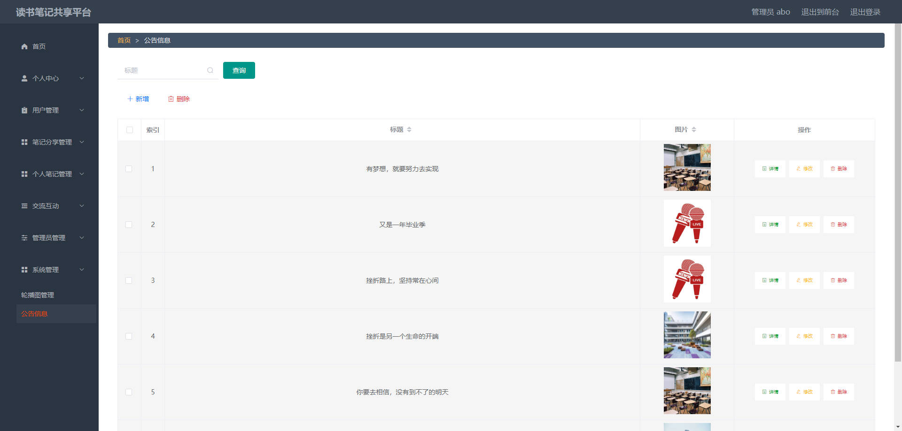

## 访问路径

### 前台

```properties
http://localhost:8080/springbootf3x3h/front/pages/login/login.html

账号 用户名6
密码 123456
```

### 后台

```properties
http://localhost:8080/springbootf3x3h/admin/dist/index.html#/login

账号 abo
密码 abo
```


## 功能图

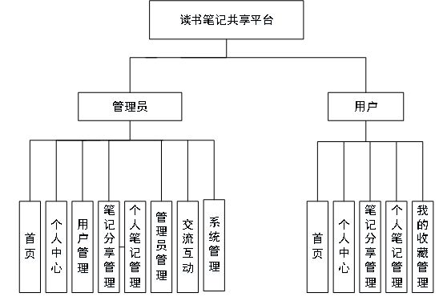


## 文档目录

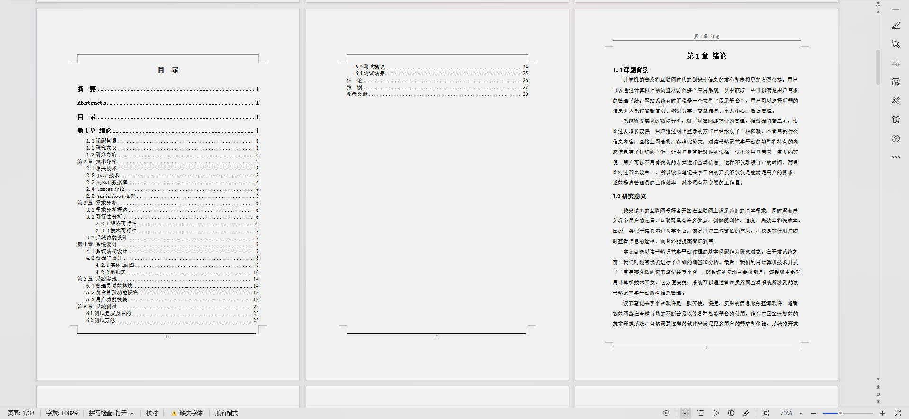


## 打赏或交流


